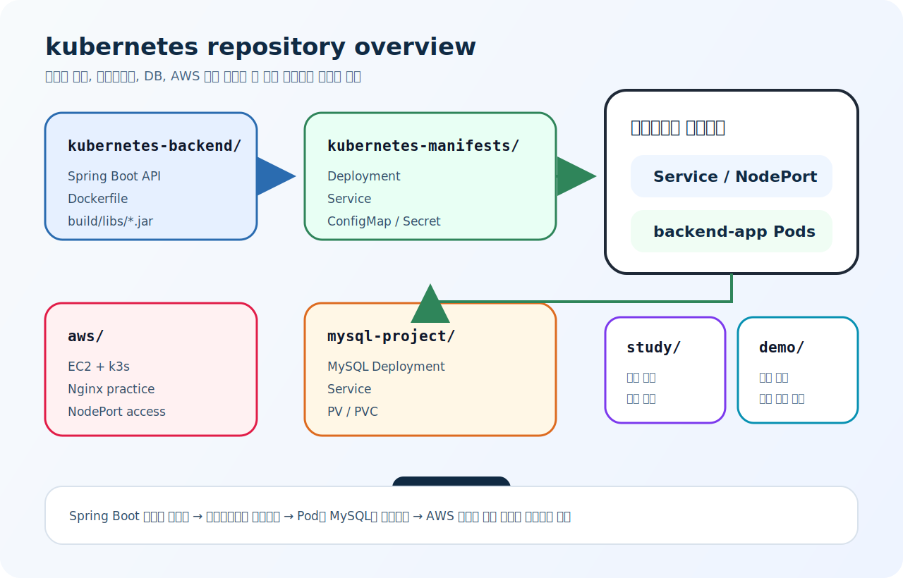

# kubernetes

Spring Boot, MySQL, Kubernetes, AWS 실습을 한곳에 모은 저장소입니다.

## 한눈에 보기



## 핵심만 보기

- `kubernetes-backend/`: Spring Boot 백엔드 소스와 Docker 빌드
- `kubernetes-manifests/`: 백엔드용 Deployment, Service, ConfigMap, Secret
- `mysql-project/`: MySQL용 Deployment, Service, PV, PVC
- `aws/`: EC2 + `k3s` + Nginx 실습
- `study/`: 쿠버네티스 학습 노트
- `demo/`: 초기에 만든 단일 폴더 예제

## 실행 순서

1. `kubernetes-backend/`에서 앱을 빌드하고 이미지를 만든다.
2. `mysql-project/`로 MySQL을 띄운다.
3. `kubernetes-manifests/`로 Spring 앱을 배포한다.
4. Service 또는 NodePort로 앱에 접근한다.
5. 앱은 ConfigMap, Secret, MySQL을 사용한다.

## 자주 쓰는 명령

```bash
cd kubernetes-backend
./gradlew clean build
docker build -t kube-ecr:1.0 .
```

```bash
kubectl apply -f mysql-project/
kubectl apply -f kubernetes-manifests/
kubectl get pods
kubectl get svc
```

```bash
kubectl apply -f aws/
kubectl get deploy
kubectl get pods
kubectl get svc
```
